## Disclaimer

The following work was done using virutal machines and a fake social media website. The exploits shown here should never be used against a website you do not have permission to modify or test (besides, nowadays, this is pretty much patched everywhere, so don't get any big ideas!).

# Introduction

In the previous lab, Cross-Site Scripting, there was a section where, once I (the attacker) gained access to the victim’s Elgg account, sent out friend requests in his name using fabricated HTML requests. This is an example of cross-site request forgery. In this lab, I will be further exploring this concept by demonstrating two instances of CSRF and an effective countermeasure that can be taken against them.

## Preparing the Lab Environment

Like I have done the previous labs, I will be using Labtainer on my Virtual Machine. To begin, I type in the command “labtainer xforge” to instruct Labtainer to retrieve the lab and pass my e-mail address as a way of authentication. I then hit “enter” to start the lab. The lab environment then appears with four different computer terminals: In the first terminal are two sub-terminals for users “alice” and “boby”, and in the second are two-sub-terminals that serve as the Elgg website and the attacker’s malicious website.

-_Figure 1_: The lab environment. On the left is the terminal for the users, and on the right is the terminal for the servers.

  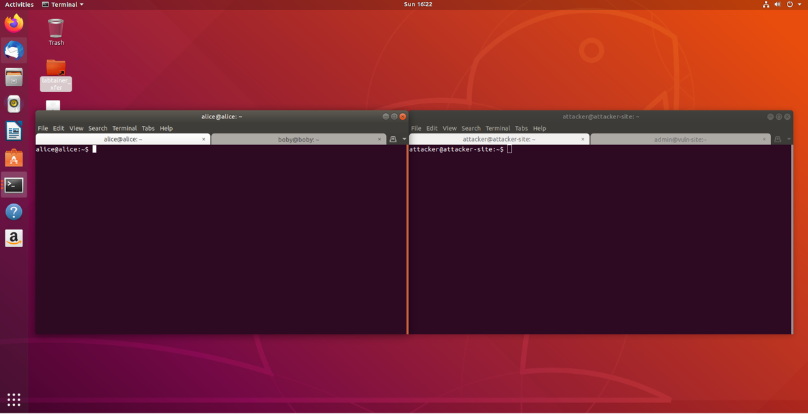

## CSRF Attack Using GET Request

I begin by typing the command “firefox” in both the “alice” and “boby” terminals to open their Firefox browsers. Then, using the provided URL, I take both browsers to the lab’s Elgg website. The scenario that the lab proposes is Boby wants to add Alice to his friends list, but Alice refuses to add him. In response, Boby wishes to a use cross-site request forgery to forcibly add her. 

Recalling the notes, in order for Boby’s attack to be successful, he must make sure that Alice is simultaneously visiting both the trusted Elgg page and Boby’s malicious website (and, of course, that there are no CSRF safeguards on the website). From there, Boby needs to set up his malicious site so that it retrieves Alice’s session cookie and attaches it to the HTTP GET request that is sent for adding Boby.

In the previous lab, the cross-site request forgery attack was achieved using a pre-written JavaScript code. This time, I will have to make sure the attack is done by Alice merely visiting the website. To begin, I need to see what the GET request looks like when I add a friend. To do so, as Boby, I add the user “Charlie” to my friends list and use the network monitoring tool to capture the HTTP GET request that is sent out.

-_Figure 2_: The HTTP GET request that is sent after adding Charlie as a friend. The point of interest here is the “Request URL” field at the top of the window. I will be using the information here to craft my HTTP GET request

  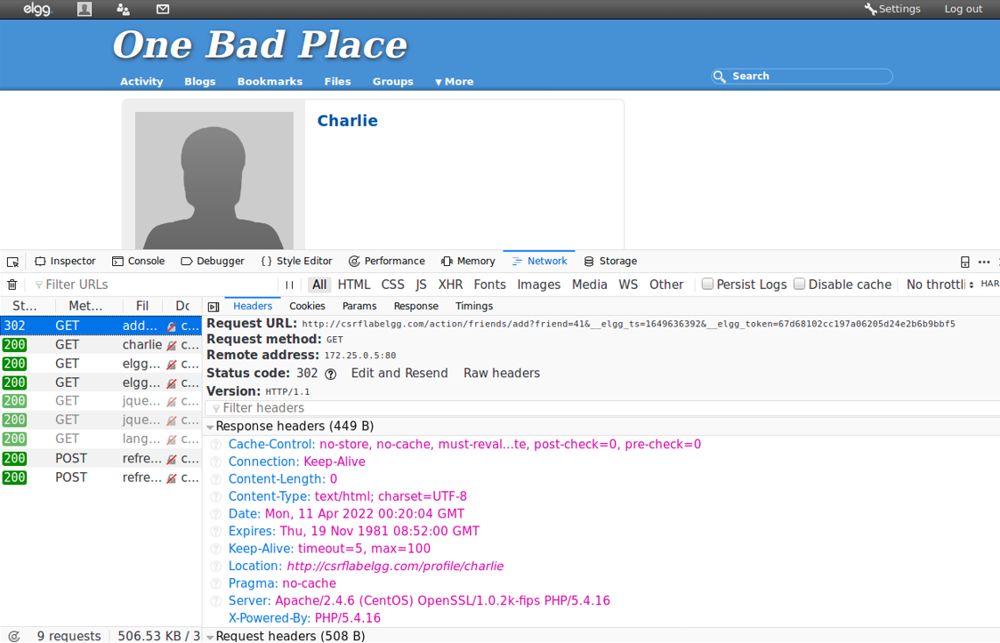

Then, using the URL I obtained, I craft a simple HTML page on the malicious website’s server that has an image with the source URL being the one needed to add Alice. Since the image’s source URL is different from the page’s, Alice’s browser will have to send out a GET request to the source URL to retrieve the image. Of course, since this is not a real image, nothing but the “alt” text will load, and Alice will have unknowingly added Boby as a friend.

-_Figure 3_: The HTML code to be executed on the malicious website. Notice that the source URL is the same as the first half of the URL I captured by adding Charlie with the only difference being the “friend” value set to 40. This value represents Boby’s account. Since this version of Elgg does not have any safeguards against CSRF, I do not have to worry about the “ts” or “token” values.

  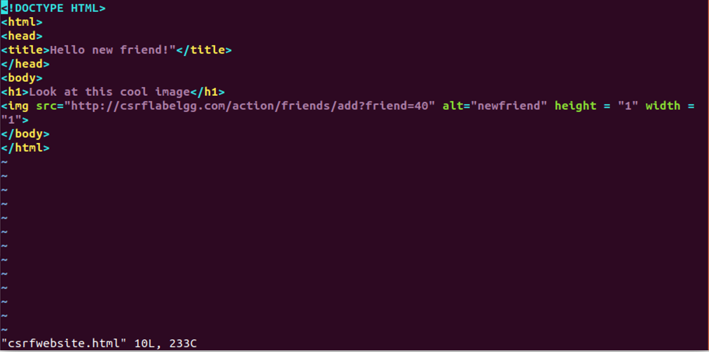

With the malicious site crafted, it is now time to set Boby’s trap. I send a message to Alice enticing her to visit the website. In the message window, I disable the editor and manually type out the message in HTML. I use the “<a>” tag to define a hyperlink that leads to my malicious website while disguising it as a different name.

-_Figure 4_: The trap message crafted in HTML. As Boby, I lure Alice into clicking on the link by enticing her with the promise of a “cool” website. Then, I make a hyperlink to the site with a disarming name to not give myself away.

  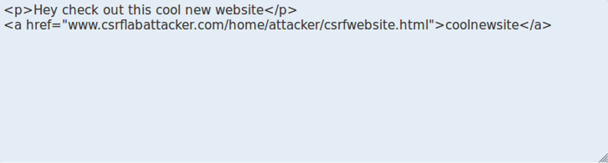

Now, switching as Alice, I open her inbox and see Boby’s message. I open it and click on the hyperlink and, as expected, am led to the malicious website.

-_Figure 5_: Alice on the malicious website. The text I had written appears, and of course, there is no image to be seen. Just by Alice visiting this site, an HTTP GET request for adding Boby as a friend has just been sent out through her browser.

  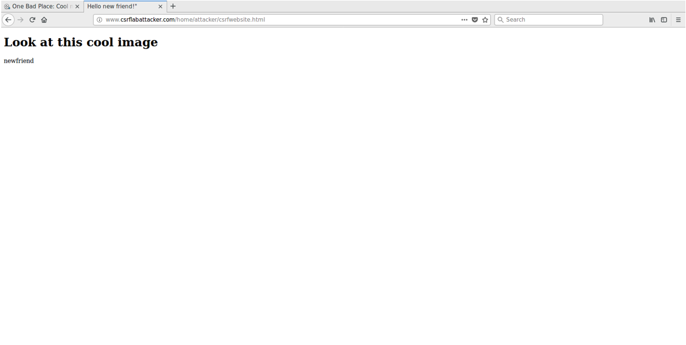

Then, with the site still open, I go to Alice’s activity page to find this:

-_Figure 6_: Alice’s activity page. Notice that the first entry is Boby adding Charlie to get the layout of the HTTP GET request, and the most recent entry shows that Alice is now friends with Boby. Disregard the middle entry.

  

By only visiting the site as Alice, and without even clicking anything, I have added Boby as a friend without meaning to. This means that Boby’s cross-site request forgery attack was successful and the two of them are now friends whether Alice likes it or not.

## CSRF Attack Using POST Request

This next task follows the same principle, but with a few changes. This time, Alice wishes to forcibly add a statement to Boby’s profile page. Since editing and submitting changes to a profile page uses the HTTP POST request, I will have to make my new malicious site so that a POST request is sent on Boby’s behalf to modify his user profile.

Recalling from the notes, POST methods can also be used for a CSRF attack by making the malicious website create a form mirroring the parameters of the target website’s editing page and using the JavaScript event “onload” to submit the page.

Like the previous task, before I can create my site, I first must know what the POST request looks like when editing a user’s profile. To do so, as Alice, I go to my user profile and open the network monitor again. Next, I edit the description field by adding the statement I wish to add to Boby’s profile. I then hit “submit” and the packet I need is sent out. An alternative (and perhaps simpler) way would have been to look for the <form> flag in the “Inspector” and look for the “action” field.

-_Figure 7_: The HTTP POST request that is sent after editing my profile as Alice. Again, the point of interest here is the “Request URL” field.

  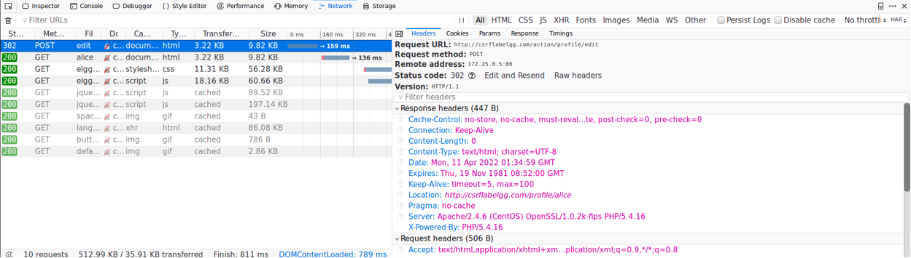

I am now ready to make my malicious website. The two things I really need are the HTTP POST request URL and the friend GUID for Boby. From there, I simply follow the template provided.

-_Figure 8_: The lower half of the HTML code for my POST CSRF attack. This area is where I have made the edits. In the first “fields” line, I have made sure that Boby’s name remains unchanged. In the second, I insert the statement I want to add to his profile. Then, for the last field, I apply Boby’s GUID value. Lastly, for the “url” variable, I add the URL I retrieved from the previous step.

  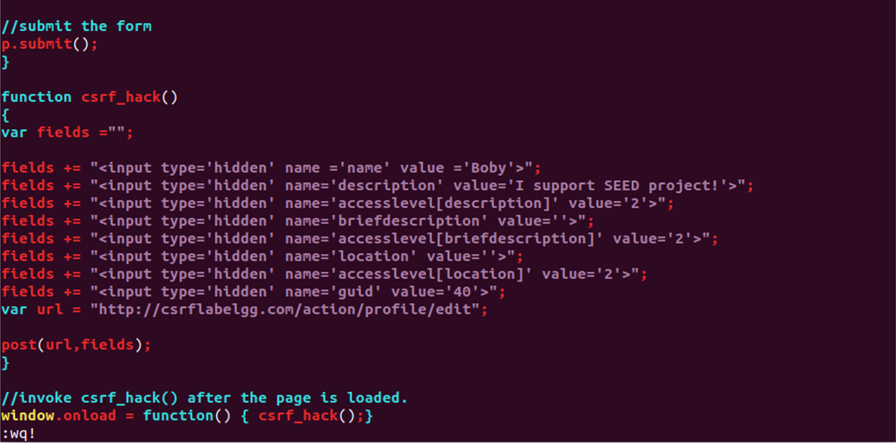

With this done, as Alice, I send Boby a message with a hyperlink that directs to my new malicious website.

-_Figure 9_: The message sent from Alice to Boby. Embedded in the <a> tag is the URL for my malicious page.

  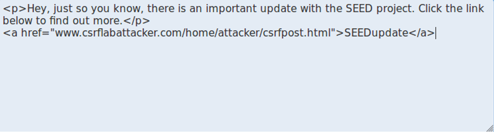

Now, going back as Boby, I open the message and click the link.

-_Figure 10_: Boby visiting the malicious page. Upon seeing this page, an HTTP POST request has already been sent out to change Boby’s “About Me” field.

  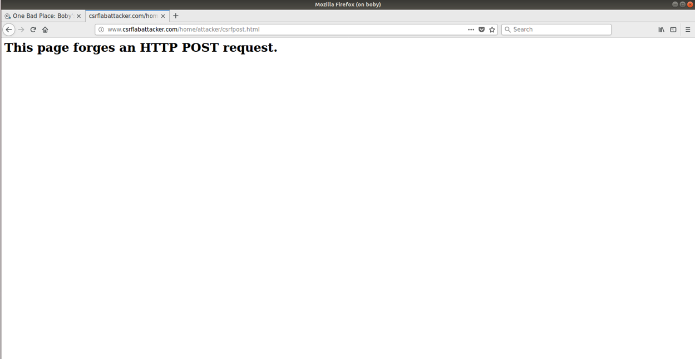

Sure enough, after revisiting my profile page as Boby, my “About Me” field has been changed to the statement Alice wanted.

-_Figure 11_: Boby’s profile page while visiting the malicious site. My “About Me” field now has the statement Alice wanted and looking in the top-right corner shows a notification that was displayed after visiting the malicious site.

  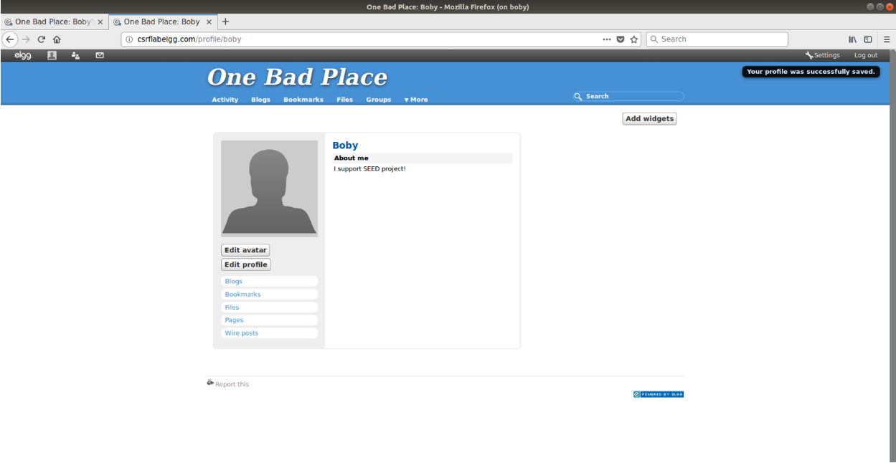

Upon seeing this, I conclude that Alice’s cross-site request forgery attack was successful.

For this lab, I have the advantage of already knowing all the users’ GUIDs since they are the same as those in the previous lab. However, supposing Alice did not have access to this information, she could still find Boby’s GUID by using JavaScript’s “getElementById(id)” method and inserting the ID value that represents the user’s GUID.

I also conclude that Alice could still launch her CSRF attack on anyone who visits her page. Looking at this task, all I really needed was the URL for the “post” action and the user’s GUID. The “post” action URL remains unchanged, but if Alice were to modify the code so that the victim’s GUID is extracted and stored in a variable with the “getElementById” method, and that variable is then plugged into the forged URL, I believe the attack would still work.

# Countermeasures

Elgg does already have countermeasures in place for CSRF, but for this lab, they had to be turned off. This task is focused on reimplementing these countermeasures are preventing attacks like the ones I had just performed. Recalling previous lab and the notes, one of the most effective ways to prevent CSRF is to implement a secret-token system. In the previous lab, Elgg had “token” and “ts” values appended to the URL that would change every time a request was submitted. This part of the lab is dedicated to reimplementing this countermeasure.

On the website’s server terminal, I first change the working directory to “/var/www/csrflabelgg.com/elgg”, then change it to “engine/lib”. From there, I list the available files and open the actions.php file in vim. I then navigate downward until I find the lines specified in the directions. Then, as instructed, I comment out the “return true;” line.

-_Figure 12_: The terminal window for the Elgg server. Notice that I have commented out the “return true;” line per the instructions.

  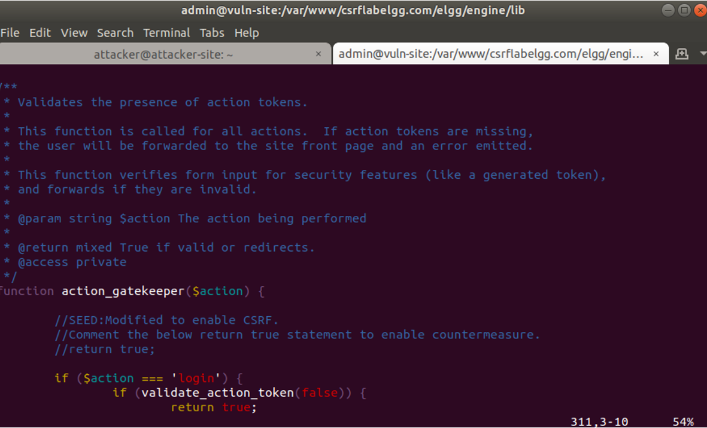

With this done, Elgg’s CSRF countermeasure is now enabled. To prove this, I will attempt to do the CSRF attack in the previous step again, only this time with a different description. Upon revisiting Alice’s malicious site as Boby, I notice that the page’s title keeps flickering (possibly due to repeated attempts to send the request). Moreover, on Boby’s profile page, there is no new traffic shown in the network monitor (previously, a POST packet appeared).

-_Figure 12_: The internet traffic for Boby’s profile page. Notice how there is no POST packet to be seen, and Boby’s description remains unchanged. Also notice the numerous failed attempts at changing the field due to missing “token” and “ts” values.

  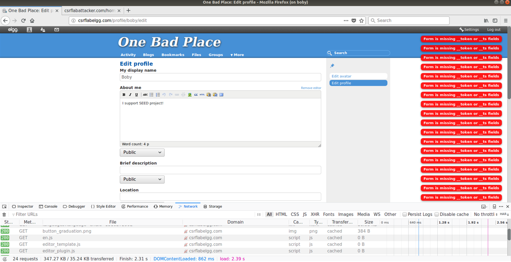

Moreover, looking at why this is, I make a slight edit to the “Brief Description” field and submit it with the network monitor running. I then capture the POST packet sent from the edit and analyze the request body. Now, unlike before, there are values for “elgg_token” and “elgg_ts”. These are the secret tokens that authenticated this edit, but not the previous one

-_Figure 13_: The request body from the authenticated edit. There are now values for the “token” and “ts” fields.

With this in place, an attacker cannot successfully commit a CSRF attack. These “token” and “ts” values change every time a request is submitted or re-submitted. Recalling the previous lab, I could only perform the CSRF attack because I simultaneously knew the “token” and “ts” values and could commit the attack. Therefore, it is impossible to preemptively retrieve these values.

# Conclusion

The goal of this lab is to demonstrate CSRF and why it can be a huge problem for websites. Then, I show an effective countermeasure that can be used to prevent it. I think this is a good countermeasure because nearly every secure site I can think of uses a sort of token system for authentication. Therefore, aside from some idealized circumstances in the lab, I believe this lab is very practical.

